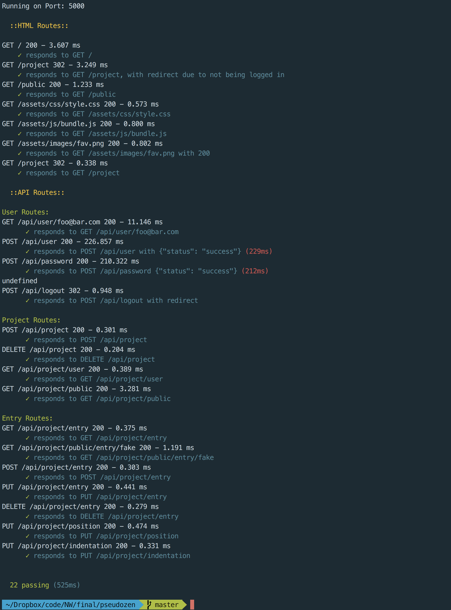

# Pseudo Zen

#### Try It Now: [https://pseudo-zen.com/](https://pseudo-zen.com/)
Sandbox Account: { User: example@account.com, Password: foobar }
 

Pseudo Zen is an online pseudocoder that makes pseudocoding as easy at it should be. With Pseudo Zen, there's no longer an excuse for not pseudo-coding your projects beforehand.

The editor uses an intuitive and clean visual UI, where entries can be added, moved and removed all within a few clicks. It accentuates what matters while avoiding superfluous clutter. This allows you to just focus on the logic, without getting hung up on syntax.

Projects can also be publicly shared, allowing others to see your thought process. This is ideal for quick mockups to confirm everyone is on the same page, or for impromptu training sessions.

* Front-end using __React__, with __PropTypes__ module for prop validation (dev-mode), and __validator.js__ for form validation. 
* __Webpack__ and __Babel__ used for transpiling and JS uglifying. 
* __REST API__ server using __Node__ and __Express__. 
* User data persisted using __MongoDB/Mongoose__. 
* Server hosted on a __Ubuntu Linux__ VPS. 
* __NGINX__ used for reverse proxy and for gzipping outgoing static files, and SSL. 
* SSL certificate from __Let's Encrypt__.
* __PM2__ with __Keymetrics__ used for Node and MongoDB monitoring and exception notification. 
* __Travis CI__, __Mocha__ and __Supertest__ used for API endpoint testing, and __Prettier__ for pre-commit formatting. 
* __Snyk__ and __Helmet__ used for dependency vulnerability check and header security.

 ## Technology Used
 React, Express, Node.js, MongoDB, Mongoose, Webpack, Babel, Axios, Validator.js
 
 ### Session Management
 Bcrypt, Express-Session
 
 ### Middleware
 Helmet, Morgan
 
 ### Linting & Testing
 Prettier, Eslint, Travis CI, Mocha, Supertest, Gemnasium, Snyk
 
 ### Deployment & Monitoring
 Ubuntu Linux, NGINX, PM2, Keymetrics, Let's Encrypt

SSL Labs: [Report](https://www.ssllabs.com/ssltest/analyze.html?d=pseudo-zen.com)

